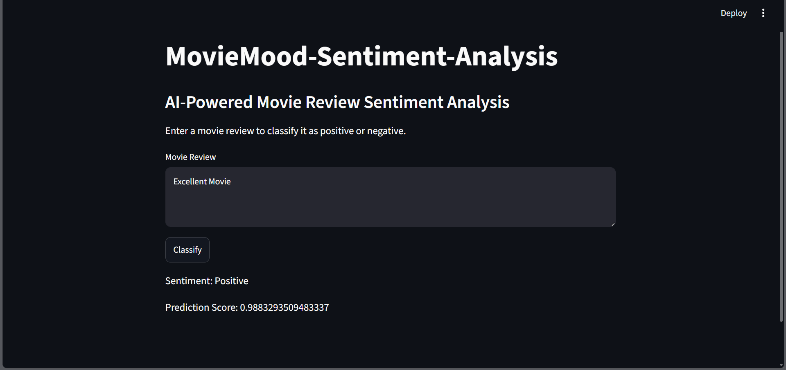

# 🎬 MovieMood: Sentiment Analysis

AI-powered movie review sentiment analysis using **Simple RNN**, **TensorFlow**, and **Streamlit**.

## 📌 Overview

MovieMood is a Natural Language Processing (NLP) project that predicts whether a movie review expresses a **Positive** or **Negative** sentiment.

The model is trained on the IMDB Movie Reviews Dataset using a Simple Recurrent Neural Network (RNN) and deployed through a Streamlit web application.

---

## 🚀 Features

* Predicts sentiment from movie reviews
* Deep Learning-based text classification
* Interactive Streamlit web application
* IMDB Dataset integration
* Text preprocessing and sequence padding
* End-to-end NLP pipeline

---

## 🛠️ Tech Stack

* Python
* TensorFlow
* Keras
* Streamlit
* NumPy
* IMDB Dataset

---

## 📂 Project Structure

```text
MovieMood-Sentiment-Analysis/
│
├── main.py
├── simple_rnn_imdb.h5
├── embedding.ipynb
├── simplernn.ipynb
├── prediction.ipynb
├── requirements.txt
├── .gitignore
└── Screenshot/
```

---

## 🧠 Model Architecture

```text
Input Review
     ↓
Embedding Layer
     ↓
Simple RNN Layer
     ↓
Dense Layer (Sigmoid)
     ↓
Sentiment Prediction
```

---

## 📊 Dataset

This project uses the IMDB Movie Reviews Dataset available through TensorFlow/Keras.

* Binary Sentiment Classification
* Positive Reviews
* Negative Reviews

---

## ⚙️ Installation

Clone the repository:

```bash
git clone https://github.com/jainkhushi22/MovieMood-Sentiment-Analysis.git
```

Move into the project directory:

```bash
cd MovieMood-Sentiment-Analysis
```

Install dependencies:

```bash
pip install -r requirements.txt
```

---

## ▶️ Run the Application

```bash
streamlit run main.py
```

The application will open in your browser.

---

## 📸 Application Preview

### MovieMood Web Application



The application allows users to enter a movie review and instantly predicts whether the sentiment is positive or negative using a Simple RNN model trained on the IMDB dataset.
```

---

## 🎯 Future Improvements

* LSTM-based sentiment analysis
* GRU implementation
* Transformer-based models
* Improved text preprocessing
* Cloud deployment
* Docker support

---

## 👩‍💻 Author

**Khushi Jain**

AI & Machine Learning Enthusiast

GitHub: https://github.com/jainkhushi22

---

## ⭐ Support

If you found this project useful, consider giving it a star on GitHub.
